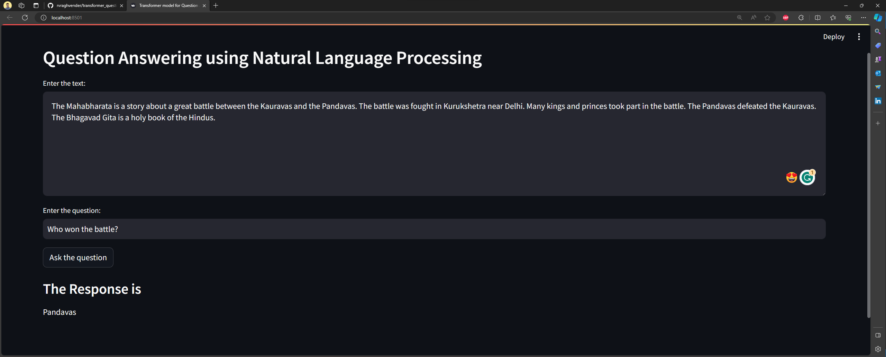

<div align="center">

# 🚀 Transformers Model for Question Answering Task using Natural Language Processing

</div>

## Objective of this project
This project aims to leverage the power of the DistilBERT Transformer model from HuggingFace (🤗) for natural language understanding. The focus is on fine-tuning the pre-trained DistilBERT model on the Facebook bAbI dataset. By adapting the model to this specific task, we aim to enhance its performance in question-answering scenarios. The project not only explores the capabilities of the DistilBERT model but also contributes to advancing the field of natural language processing.

**Dataset**:  [babi_qa](https://huggingface.co/datasets/facebook/babi_qa)


<caption><center><font color='purple'><b>Figure 1</b>: "Interactive "Streamlit" Application - Explore the magic of natural language understanding! 🚀 Enter text in the top box, ask questions below, and witness the AI-powered responses. Just click the 'ASK the question' button to unlock the potential of your words. Seamless and intuitive, bringing NLP to your fingertips. </center></caption>

### DistilBERT for Computational Efficiency:
DistilBERT, short for "Distilled BERT," is a lighter and more compact version of the original BERT (Bidirectional Encoder Representations from Transformers) model. It is designed to provide a good balance between model size and performance. The distillation process involves training a smaller model to mimic the behavior of a larger model, capturing essential features while reducing complexity.

### Reduced Number of Tokens:
One key advantage of DistilBERT is that it requires fewer parameters and tokens compared to larger models like BERT. This is particularly beneficial when working with limited computational resources. DistilBERT achieves this reduction by retaining the essential information from the attention mechanism of BERT while simplifying certain aspects of the architecture.

### Local Execution on Personal Laptop:
Due to its reduced size and computational requirements, DistilBERT is well-suited for local execution on personal laptops. This makes it a practical choice for individual researchers or practitioners who may not have access to powerful computing clusters but still want to explore and experiment with state-of-the-art natural language processing models.

#### Workflows for End-To-End Project Implementation

1. Introduction & GitHub Repository setup     ✅
2. Project Template Creation                  ✅
3. Project setup & Requirement Installation   ✅
4. Logging, Utils & Exception Modules         ✅
5. Project Workflows                          ✅   
6. All components notebook experiment         ✅
7. All components modular code implementation ✅
8. Training Pipeline                          ✅
9. Prediction Pipeline & User App Creation    ✅
10. Final CI/CD Deployment on AWS             


#### Update strategy

1. config.yaml
2. params.yaml
3. entity
4. configuration manager in src/config 
5. components
6. pipeline
7. main.py
8. app.py


# Steps to run:

1.  Clone the repository:    
    ```https://github.com/rvraghvender/transformer_question_answering.git```
2.  Create a conda environment in the /path/to/transformer_question_answering/ directory
    a.  ```conda create -n transformers_qa python='3.8' -y```       
    b.  ```conda activate transformes_qa```        
    c.  ```pip install -r requirements.txt```         
    d.  ```streamlit run app.py```        
    e.  open your local host and port.    
